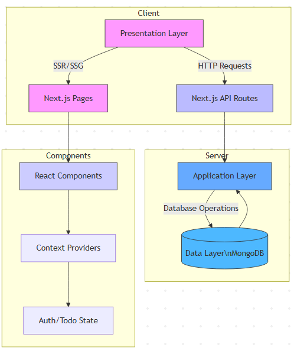

# Todo Application with Next.js and MongoDB

## Prerequisites
- Node.js 18.x or higher
- MongoDB (local instance or MongoDB Atlas)
- Git
- pnpm (recommended) or npm/yarn

## Installation Steps

### 1. Clone the Repository
```bash
git clone https://github.com/KikyoBRV/todo_app.git
cd todo_app
```

### 2. Install Dependencies
```bash
# Using pnpm (recommended)
pnpm install

# Or using npm
npm install
```

### 3. Environment Setup

#### 3.1 Create Environment File
```bash
# On MacOS/Linux
cp .env.local.example .env.local

# On Windows (Command Prompt)
copy sample.env.local .env.local
```

#### 3.2 Configure Docker & MongoDB
1. Install Docker. https://www.docker.com/get-started/ (In case you don't have Docker Desktop)

2. Install MongoDB Compass. https://www.mongodb.com/try/download/compass

3. Open Terminal/PowerShell.

4. Execute the command to run the image as a container. Execute the command to run the image as a container.
```
docker run --name mongo -p 27017:27017 -d mongodb/mongodb-community-server:latest
```
5. Execute the command to verify that the container is running.
```
docker container ls
// You should see one mongodb/mongodb-community-server container running.
```
6. Open MongoDB application and connect to your MongoDB instance at mongodb://localhost:27017, which is the default value. 
    - click "+" which is "Add new connection"
    - Click "save & connect"

   Verify that the connection is successful and three default databases are visible: admin, config, and local.

Edit `.env.local` and set your MongoDB connection string:
```bash
MONGODB_URI=mongodb://localhost:27017/todoapp
JWT_SECRET=your-secure-secret-key-here
```
Edit the JWT_SECRET by going to https://jwtsecret.com/generate. Set the "Secret Length" to 32, then click "Generate." Copy the generated secret and replace the current JWT_SECRET with it.

### 4. Run the Application
```bash
pnpm run dev
```

### 5. Access the Application
Open your browser and visit:
```
http://localhost:3000
```

## Testing Credentials
You can try signing up a user with this format, or use any email and password you prefer.
- Email: `test@example.com`
- Password: `password123`

## Key Features
- User authentication (Signup/Login/Logout)
- Create todos with title, description, and due date
- Mark todos as complete/in progress
- Edit existing todos
- Responsive design with a calendar that shows how many tasks each date has, based on the tasks' due dates.

##  Framework
**Next.js** (Full-stack React framework) with:
- **Pages Router** (`/pages` structure)
- **API Routes** (Backend endpoints)
- **React 18** (Components/hooks)
- **Context API** (Global state management)

## Database
**MongoDB** (NoSQL document database)

### Collections Structure:
```javascript
// users collection
{
  _id: ObjectId,
  email: String,        // Unique
  password: String,     // bcrypt-hashed
  createdAt: DateTime
}

// todos collection 
{
  _id: ObjectId,
  title: String,
  description: String,
  status: String,       // ['In Progress', 'Done', 'Overdue']
  dueDate: DateTime,
  userId: ObjectId,     // Reference to users
  createdAt: DateTime
}
```

## Application Deployment

### Local Development:
```
# 1. Install dependencies
pnpm install

# 2. Start MongoDB (via Docker)
docker-compose up -d mongo

# 3. Run dev server
pnpm dev
```
## Code Explanation
### Key Design Decisions:
1. Authentication:
    - JWT tokens stored in HTTP-only cookies
    - Password hashing with bcryptjs
    - Context API for user state management
2. API Structure:
```
/api/auth/
  ├── signup  (POST) - User registration
  ├── login   (POST) - Session creation
  └── logout  (POST) - Session invalidation

/api/todos/
  ├── [GET]    - List todos
  ├── [POST]   - Create todo
  └── /[id]
      ├── [PUT]    - Update todo
      └── [DELETE] - Remove todo
```
3.Frontend Architecture:
- Component-based UI with:
    - EditTodoModal: Controlled form with validation
    - Calendar: Date picker integration
- Client-side data fetching with axios
- CSS Modules for scoped styling

### Software Architecture:
#### Layered Architecture with:
- Presentation Layer: React components
- Application Layer: Next.js API routes
- Data Layer: MongoDB models

## Project Structure
```
src/
├── components/            # React components
│   ├── Calendar.js        # Calendar component
│   └── EditTodoModal.js   # Todo editing modal
│
├── context/               # React context providers
│   └── AuthContext.js     # Authentication context
│
├── lib/                   # Utility functions
│   ├── auth.js            # Authentication helpers
│   └── mongodb.js         # MongoDB connection
│
├── models/                # MongoDB models
│   ├── Todo.js            # Todo model/schema
│   └── User.js            # User model/schema
│
├── pages/                 # Next.js pages and API routes
│   ├── api/               # API routes
│   │   ├── auth/          # Authentication endpoints
│   │   ├── todos/         # Todo endpoints
│   │   └── hello.ts       # Test endpoint
│   │
│   ├── _app.js            # Custom App component
│   ├── _document.js       # Custom Document component
│   ├── index.js           # Home page
│   ├── login.js           # Login page
│   └── signup.js          # Signup page
│
└── styles/                # CSS files
    ├── Auth.module.css    # CSS Modules for auth
    └── globals.css        # Global styles
```
## Layered Architecture Diagram



### Layer Breakdown:
#### 1. Presentation Layer (Pink)
- Next.js pages (/pages/*)
- Handles UI rendering and user interactions
#### 2. Application Layer (Blue)
- API Routes (/pages/api/*)
- Contains business logic and request handling
#### 3. Data Layer (Light Blue)
- MongoDB models (/models/*)
- Manages data persistence and queries
#### 4. Component Layer (Purple)
- React components (/components/*)
- Context providers for state management